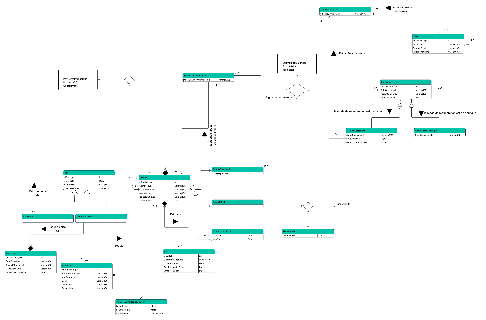

---
output:
  html_document: default
---
# Rapport Hebdomadaire - Projet Base de Données

**Semaine :** Semaine 1 (du 20/10 au 26/10)

---

## 1. Objectifs de la semaine
- Analyse
- Modèle Entité/Association
- Passage au Relationnel

## 2. Organisation du travail
L’équipe s’est divisée en deux sous-groupes afin d’avancer plus efficacement sur la phase de conception :

- **Groupe 1 : Hiba et Faical**  
  → Analyse du domaine, conception du diagramme Entité-Association (EA) et définition des relations correspondantes.

- **Groupe 2 : Mouad, Hamza et Makhtour**  
  → Analyse parallèle du même domaine, conception d’un second diagramme EA et établissement de leurs propres relations.

Après la réalisation individuelle des deux analyses, les deux groupes se sont réunis pour **comparer et fusionner leurs modèles**, en identifiant les différences et en choisissant les meilleures approches pour construire un **modèle unifié et cohérent**.

## 3. Analyse :

| DF | CV | DM | Autres |
|----|----|----|--------|
| **idProducteur** → NomProducteur, PrénomProducteur, AdresseComplete, Latitude, Longitude, Téléphone, Email   **AdresseComplete** → Latitude, Longitude, Complement | *TypeActivité* ∈ {Agriculteur, Éleveur, Fromager, Autre}   *Latitude* ∈ [-180, 180]   *Longitude* ∈ [-90, 90] | 1 idProducteur → 1..* TypeActivité | Contacts = email et téléphone   Longitude et latitude en degrés |
| **idProduit** → NomProduit, CatégorieProduit, Description, Caractéristiques, idProducteur   **(idProduit, ModeConditionnement)** → PrixAchatProducteur, PrixVenteTTC, UnitéDeVente   **SaisonDisponibilité** → DateDébut, DateFin | *CatégorieProduit* ∈ {Fromage, boisson, céréales, légumineuse, fruits secs, huile, autre}   *ModeConditionnement* ∈ {vrac, préconditionné}   *PrixAchatProducteur*, *PrixVenteTTC*, *UnitéDeVente* ≥ 0   *DateDébut* < *DateFin* | 1 idProducteur → 0..* idProduits   1 idProduit → 1..2 ModeConditionnement   1 idProduit → 0..* SaisonDisponibilité   DateDébut < DateFin |  Caractéristiques (bio, label, allergènes, origine)|
| **(idLot, idProduit)** → QuantitéDisponible, DateRéception, DatePéremptionType, DatePeremption | *DatePeremptionType* ∈ {DLC, DLUO} (ou exclusif)   *DateRéception* < *DatePeremption* | 1 idProduit → 0..* idLot | Le stock total d’un produit = somme de qnt dispo dans chacun de ses lots   À T-7 jours avant DLC/DLUO : générer alerte et appliquer réduction automatique (paramétrable) |
| **idContenant** → TypeContenant, CapacitéContenant, StockDisponible, ReutilisableContenant | *TypeContenant* ∈ {bocal en verre, sachet kraft, sachet tissu, papier ciré, autre}   *CapacitéContenant*, *StockDisponible* ≥ 0   *ReutilisableContenat* ∈ {True, False} |  |  |
| **idPerte** → DatePerte, NaturePerte   **(idPerteContenant, idContenant)** → QuantitéPerdueContenant   **(idPerteProduit, idProduit)** → QuantitéPerdueProduit  | *NaturePerte* ∈ {vol, casse}   Ext(*idPerteContenant*) ⊆ Ext(*idPerte*)   Ext(*idPerteProduit*) ⊆ Ext(*idPerte*)   Ext(*idPerteContenant*) ∪ Ext(*idPerteProduit*) = Ext(*idPerte*)   Ext(*idPerteContenant*) ∩ Ext(*idPerteProduit*) = ∅   QuantitéPerdueContenant, QuantitéPerdueProduit  > 0 | 1 idPerte → 0..* idProduit   1 idPerte → 0..* idContenant | Max 1 livraison fournisseur par produit et par jour |
| **emailClient** → NomClient, PrénomClient, TéléphoneClient |  | 1 *emailClient* → 0..* *AdresseLivraison* | Droit à l’oubli : anonymisation obligatoire pour traçabilité (10 ans) |
| **idCommande** → DateCommande, HeureCommande, ModePaiement, ModeRecuperation, emailClient   **idCommandeàLivrer** → StatutCommandeL, FraisLivraison, DateLivraisonEstimée   **idCommandeBoutique** → StatutCommandeB   **idCommandeàLivrer** → AdresseLivraison   **(idCommande, idProduit, ModeConditionnement)** → QuantitéCommandée, PrixUnitaireAuMomentCommande, SousTotalLigne | Ext(*idCommandeBoutique*) ⊆ Ext(*idCommande*)   Ext(*idCommandeàLivrer*) ⊆ Ext(*idCommande*)   Ext(*idCommandeBoutique*) ∪ Ext(*idCommandeàLivrer*) = Ext(*idCommande*)   Ext(*idCommandeBoutique*) ∩ Ext(*idCommandeàLivrer*) = ∅   *StatutCommandeL* ∈ {En préparation, Prête, En livraison, Livrée, Annulée}   *StatutCommandeB* ∈ {En préparation, Prête, Récupérée, Annulée}   *QuantitéCommandée*, *PrixUnitaireAuMomentCommande*, *SousTotalLigne* > 0   *ModePaiement* ∈ {En ligne, En boutique}   *ModeRecuperation* ∈ {Retrait en boutique, Livraison à domicile}   *FraisLivraison* > 0 | 1 *emailClient* → 0..* *idCommande*   1 *idCommande* → 1..* (*idCommande*, *idProduit*) : ligne commande | Client peut annuler tant que Statut = 'En préparation'   L’épicerie peut annuler jusqu’au statut Expédiée   Les articles restent disponibles à la vente pendant la préparation   Lors du passage au statut ”Prête”, les produits sortent du stock et le client ne peut plus annuler |
| **idProduitCommande** → DélaiDisponibilitéCommande   **(idProduitStock, DateActuelle)** → DélaiDisponibilitéStock | Ext(*idProduitStock*) ⊆ Ext(*idProduit*)   Ext(*idProduitCommande*) ⊆ Ext(*idProduit*)   Ext(*idProduitStock*) ⊆ Ext(*idProduitCommande*) = Ext(*idProduit*)   *DélaiDisponibilitéStock* > 0 (en heures)   *DélaiDisponibilitéStock* ∈ {immédiate, hors saison, insuffisant} |  | Client informé de DélaiDisponibilité lors de sa commande   Si hors saison, afficher la prochaine SaisonDisponibilité   StockProduit = somme des stocks dans chaque lot |

## 4. Diagramme Entités/Associations

  

## 5. Bilan & Problèmes rencontrés
Cette première semaine a permis à l’équipe de structurer le domaine métier et de poser les bases du modèle de données. L’objectif était d’analyser les entités et leurs relations pour construire un modèle unifié.
La principale difficulté a été de concilier les différences entre les deux groupes sur la gestion des lots, des périodes de disponibilité et le délai de disponibilité. Une discussion a permis de clarifier et d’harmoniser les concepts.
La semaine prochaine, l’équipe commencera la transformation du modèle EA en modèle relationnel et définira les contraintes d’intégrité dans la base de données.